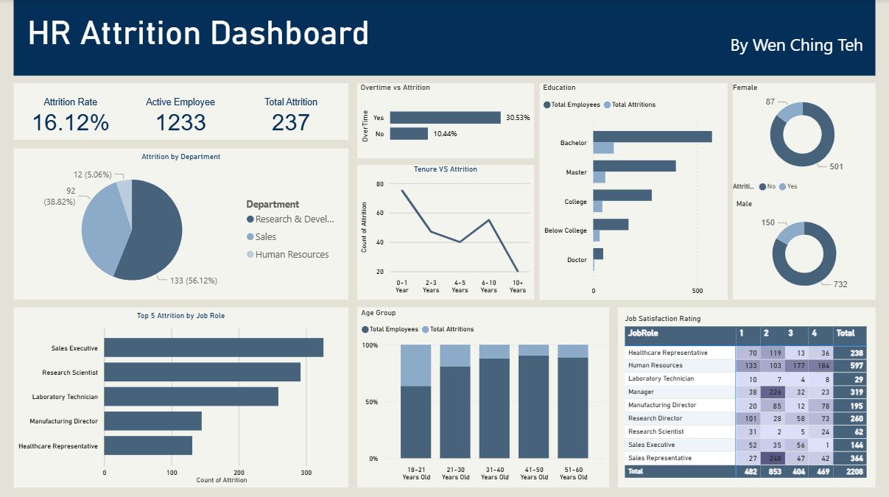

# HR-Attrition-Analysis

## Overview
This project investigates employee attrition using the **IBM HR Analytics Employee Attrition & Performance** dataset. The objective is to explore factors that contribute to employees leaving the company and present key findings through a dynamic Power BI dashboard.

Using a combination of **SQL** and **Power BI**, this analysis identifies patterns related to job satisfaction, department, overtime, income, and more—insights that can help HR teams improve retention strategies.

## Tools Used
- **SQL**: Data cleaning and exploratory analysis
- **Power BI**: Data modeling and interactive dashboard creation
- **CSV Dataset**: [IBM HR Attrition & Performance](https://www.kaggle.com/datasets/pavansubhasht/ibm-hr-analytics-attrition-dataset)

## Project Structure
├── data/
│   └── WA_Fn-UseC_-HR-Employee-Attrition.csv
├── sql/
│   └── hr_attrition_analysis.sql
├── assets/
│   └── dashboard_screenshot.png
├── PowerBI/
│   └── HR_Attrition_Analysis.pbix
└── README.md

## Key Questions Explored
- Which job roles or departments experience the highest attrition?
- Is there a relationship between job satisfaction and attrition?
- Does overtime impact the likelihood of leaving?
- Do age demographics influence retention?
- Are there differences in attrition by education field, work-life balance, or job involvement?

## Dashboard Preview

## Insights Summary
- Research and Development department has higher percentage of attrition.
- Overtime workers are more likely to leave than those with standard hours.
- Employees with shorter tenure are more likely to resign.
- Younger age groups are more likely to resign from their job compared to older age groups

---

## Author
Made by [Teh Wen Ching]
[LinkedIn](https://www.linkedin.com/in/teh-wen-ching1905/)
